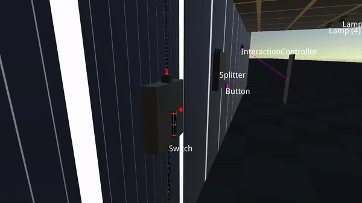

Special Guacamole
==

A [Rust](https://rust.facepunch.com/) inspired prototypey electricity system for Unity (2021.1).

It features source devices (batteries, solar panels - they do not charge and discharge as of yet), consumer devices (lamps, "interaction" controller - better known as door controllers), some helpers (a switch, a button, and i'm planning to do a timer), some basic logic gates (AND, OR, XOR) and a not-quite electronic device -but related- door.

It comes with some ugly hand made shaders and no multiplayer support because I do not hate myself and unity + multiplayer in the same prototype would be free pain for no reason.

A few notes:
  - It uses legacy input system for those two keys required (F to interact with switches, buttons and doors).
  - It uses unity starter content's fps controller because i could not be bothered to redo the same thing for the 100th time now. Also really unrelated to the prototype.
  - It's cube based because so it's my soul.

There is no copyrighted material in here except for those Unity starter content stuff that I believe is free to use, so feel free to use this however you want, credits would be nice.

